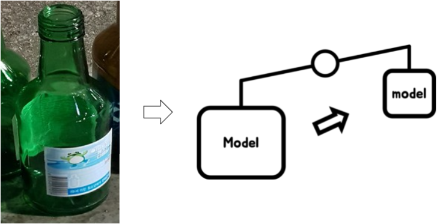

# boostcamp_pstage10
김연세, 윤석진, 이상건, 이용우, 한웅희, 황훈
<br>
  
<br>


<br>
# Docker
```bash
docker run -it --gpus all --ipc=host -v $PWD:/opt/ml/code -v ${dataset}:/opt/ml/data placidus36/pstage4_lightweight:v0.1 /bin/bash
```
# Tree
```tree
|-- Diet.gif
|-- Dockerfile
|-- LICENSE.md
|-- Makefile
|-- README.md
|-- configs
|   |-- data
|   |   |-- cifar10.yaml
|   |   |-- no_model_1st_config.yaml
|   |   |-- taco.yaml
|   |   |-- taco_4_small_continue.yaml
|   |   `-- taco_5_small_continue.yaml
|   |-- model
|   |   |-- example.yaml
|   |   |-- mobilenetv3.yaml
|   |   |-- mobilenetv3_goodmod.yaml
|   |   |-- no_model_1st_model.yaml
|   |   `-- shufflenet_v2_05_base.yaml
|   |-- vgg19_bn_config.yaml
|   `-- vgg19_bn_model.yaml
|-- environment.yml
|-- exp
|-- gitests.txt
|-- inference.py
|-- model_EDA.ipynb
|-- model_valid_score.ipynb
|-- mypy.ini
|-- shufflenet_v2_05_yaml.ipynb
|-- src
|   |-- __init__.py
|   |-- augmentation
|   |   |-- methods.py
|   |   |-- policies.py
|   |   `-- transforms.py
|   |-- dataloader.py
|   |-- decomposer.py
|   |-- loss.py
|   |-- model.py
|   |-- model_forsave.py
|   |-- modules
|   |   |-- CR.py
|   |   |-- __init__.py
|   |   |-- activations.py
|   |   |-- base_generator.py
|   |   |-- bottleneck.py
|   |   |-- conv.py
|   |   |-- dwconv.py
|   |   |-- flatten.py
|   |   |-- invertedresidual.py
|   |   |-- invertedresidualv2.py
|   |   |-- invertedresidualv3.py
|   |   |-- linear.py
|   |   |-- mbconv.py
|   |   `-- poolings.py
|   |-- trainer.py
|   |-- trainer_kd_t3_wandb.py
|   |-- trainer_kd_wandb.py
|   |-- trainer_pretrained_wandb.py
|   `-- utils
|       |-- common.py
|       |-- data.py
|       |-- inference_utils.py
|       |-- macs.py
|       |-- pytransform
|       |   |-- __init__.py
|       |   `-- _pytransform.so
|       `-- torch_utils.py
|-- tests
|   `-- test_model_parser.py
|-- train.py
|-- train_knowdistill.py
|-- train_knowdistill_efficientnetb4.py
|-- train_knowdistill_efficientnetb4_shufflenetv250_decompose.py
|-- train_knowdistill_efficientnetb4_shufflenetv250_decompose_VBMF.py
|-- train_knowdistill_efficientnetb4amobilenetv3large_shufflenetv250_decompose.py
|-- train_knowdistill_efficientnetb4amobilenetv3largeashufflenetv205.py
|-- train_knowdistill_mobilenetv3.py
|-- train_optuna.py
|-- train_pretrained.py
|-- train_wandb.py
`-- tune_wandb.py
```

# Run
## 1. train
### 1.1 train
```bash
python train.py --model ${path_to_model_config} --data ${path_to_data_config}
```
### 1.2 train with Knowledge Distillation (efficientnet b4)
#### 1.2.1 teacher: efficientnet b4
```bash
python train_knowdistill_efficientnetb4.py \
--model ${path_to_model_config} \
--data ${path_to_data_config} \
--teacher_pretrained ${path_to_teacher_pretrained_weight} \
--student_pretrained ${path_to_student_pretrained_weight}
```
#### 1.2.2 teacher: mobilenet v3 large
```bash
python train_knowdistill_mobilenetv3.py \
--model ${path_to_model_config} \
--data ${path_to_data_config} \
--teacher_pretrained ${path_to_teacher_pretrained_weight} \
--student_pretrained ${path_to_student_pretrained_weight}
```
#### 1.2.3 teacher: efficientnet b4, moblienet v3 large, shufflenet v2 x0.5
```bash
python train_knowdistill_efficientnetb4amobilenetv3largeashufflenetv205.py \
--model ${path_to_model_config} \
--data ${path_to_data_config} \
--teacher1_pretrained ${path_to_teacher1_pretrained_weight} \
--teacher2_pretrained ${path_to_teacher2_pretrained_weight} \
--teacher3_pretrained ${path_to_teacher3_pretrained_weight} \
--student_pretrained ${path_to_student_pretrained_weight}
```
### 1.3 train with decomposition (only shufflenet_v2_05_base.yaml)
#### 1.3.1 teacher: efficientnet b4
```bash
python train_knowdistill_efficientnetb4_shufflenetv250_decompose.py \
--model "configs/model/shufflenet_v2_05_base.yaml" \
--data ${path_to_data_config} \
--teacher_pretrained ${path_to_teacher_pretrained_weight} \
--student_pretrained ${path_to_student_pretrained_weight}
```
#### 1.3.2 (VBMF) teacher: efficientnet b4
```bash
python train_knowdistill_efficientnetb4_shufflenetv250_decompose_VBMF.py \
--model "configs/model/shufflenet_v2_05_base.yaml" \
--data ${path_to_data_config} \
--teacher_pretrained ${path_to_teacher_pretrained_weight} \
--student_pretrained ${path_to_student_pretrained_weight}
```
#### 1.3.3 teacher: efficientnet b4, mobilenet v3 large
```bash
python train_knowdistill_efficientnetb4amobilenetv3large_shufflenetv250_decompose.py \
--model "configs/model/shufflenet_v2_05_base.yaml" \
--data ${path_to_data_config} \
--teacher1_pretrained ${path_to_teacher1_pretrained_weight} \
--teacher2_pretrained ${path_to_teacher2_pretrained_weight} \
--student_pretrained ${path_to_student_pretrained_weight}
```

## 2. inference(submission.csv)
```bash
python inference.py --model_config configs/model/mobilenetv3.yaml --weight exp/2021-05-13_16-41-57/best.pt --img_root ~/input/data/test --data_config configs/data/taco.yaml
```
